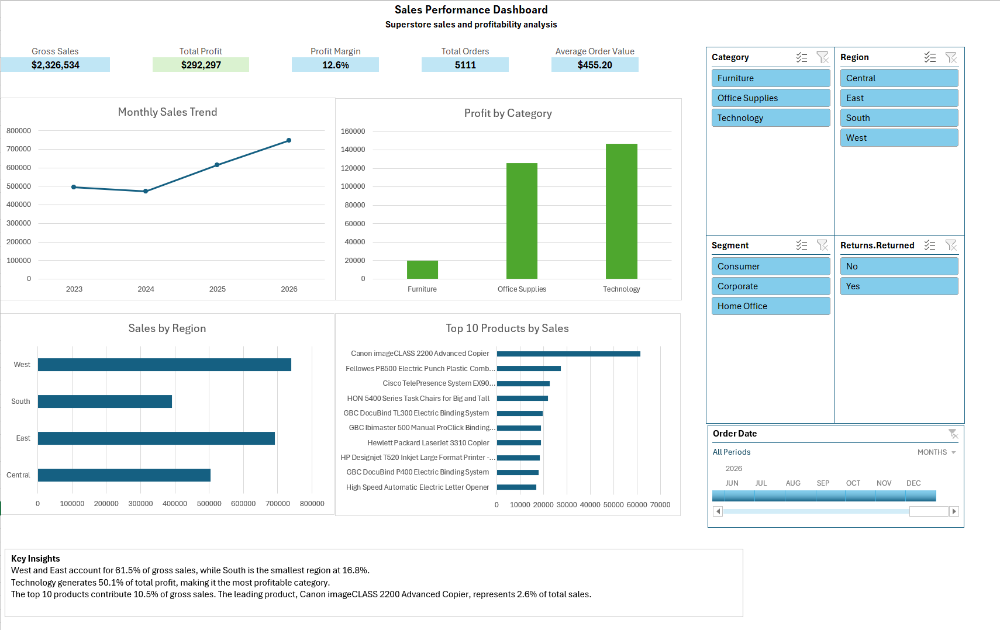

# Sales Performance Dashboard — Excel & Power Query



## Overview

This project analyzes retail sales performance using Excel and Power Query. It transforms raw transactional data into an interactive dashboard that helps identify sales trends, profitability drivers, regional performance, product concentration, and returned orders.

The dashboard is designed as a reporting solution for a retail business stakeholder who needs a concise view of commercial performance.

## Business Questions

- How are gross sales trending over time?
- Which categories generate the most profit?
- Which regions contribute the most sales?
- Which products lead sales performance?
- How do returned orders affect the analysis?

## Tools Used

- Microsoft Excel
- Power Query
- PivotTables and PivotCharts
- Slicers and Timeline filters

## Data Preparation

The raw orders data was transformed in Power Query using the following steps:

- Applied appropriate data types to dates, identifiers, numeric measures, and postal codes.
- Created an `Order Month` field for monthly trend analysis.
- Created a `Days to Ship` field from order and shipping dates.
- Merged the orders table with the returns table using `Order ID`.
- Created a `Returned` status field with `Yes` and `No` values.
- Loaded the prepared table into Excel for reporting.

## Dashboard Metrics

| Metric | Result |
|---|---:|
| Gross Sales | $2,326,534 |
| Total Profit | $292,297 |
| Profit Margin | 12.6% |
| Total Orders | 5,111 |
| Average Order Value | $455.20 |

> Gross sales are not adjusted for returned orders. The `Returned` field is available as a dashboard filter.

## Key Insights

- West and East account for 61.5% of gross sales, while South is the smallest region at 16.8%.
- Technology generates 50.1% of total profit, making it the most profitable category.
- The top 10 products contribute 10.5% of gross sales. The leading product, Canon imageCLASS 2200 Advanced Copier, represents 2.6% of total sales.

## Project Structure

```text
excel-power-query-sales-dashboard/
├── data/
│   └── raw/                 # Source data, excluded from Git
├── deliverables/
│   └── sales_dashboard.xlsx
├── images/
│   └── dashboard-preview.png
└── README.md
```

## Data Source

This project uses Tableau's Sample Superstore dataset, a fictional retail dataset provided for learning and analysis.

- [Tableau sample data](https://public.tableau.com/app/resources/sample-data)
- [Download Sample Superstore](https://public.tableau.com/app/sample-data/sample_-_superstore.xls)

The raw source file is intentionally excluded from this repository. Download it from the source above and place it in `data/raw/` to reproduce the analysis.