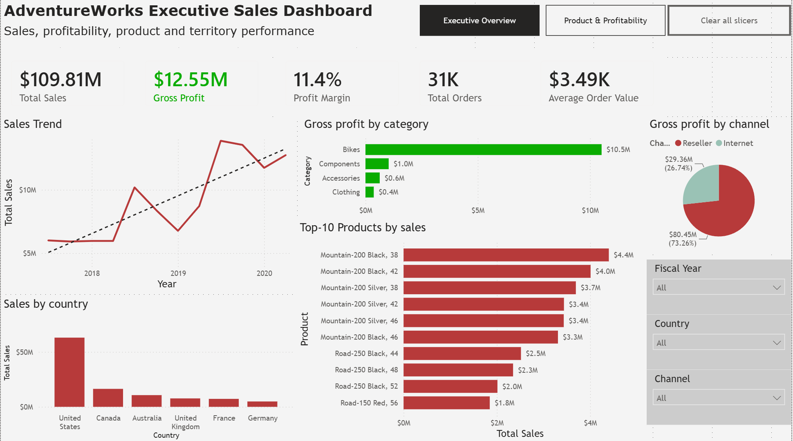
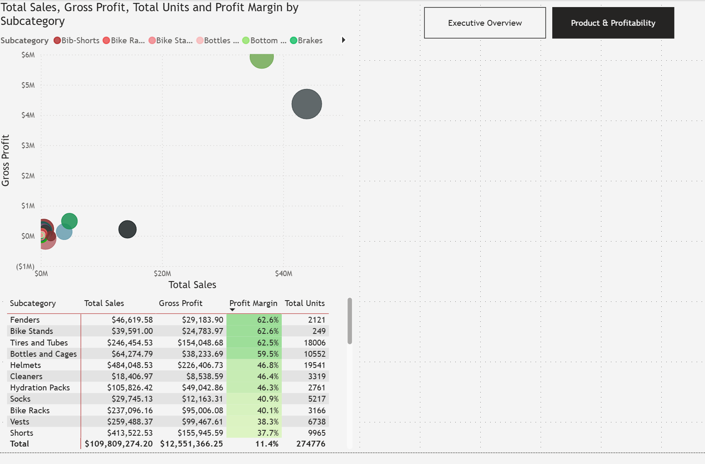

# AdventureWorks Sales & Profitability Analysis

<p align="center">
  
  
</p>

## Overview

This project presents an end-to-end sales and profitability analysis built in Microsoft Power BI using the AdventureWorks sample database.

The objective was to transform a relational sales database into an interactive business intelligence solution that allows users to monitor sales performance, profitability, product performance, sales channels, and geographic distribution.

The project focuses on the complete analytical workflow:

**Data exploration → Data validation → Data modeling → DAX measures → Data visualization → Business analysis**

---

## Business Questions

The dashboard was designed to answer questions such as:

* How are overall sales and profitability performing?
* How have sales evolved over time?
* Which product categories and subcategories generate the most profit?
* Which sales channels contribute the most revenue?
* Which territories generate the highest sales?
* Which products are the top performers?
* Which product subcategories combine high sales with relatively low profitability?
* Where might there be opportunities for further profitability analysis?

---

## Dataset

The project uses Microsoft's **AdventureWorks** sample database.

AdventureWorks is a relational database containing data related to products, sales, customers, territories, employees, and other business entities.

Source:

Microsoft Learn — AdventureWorks installation and configuration
https://learn.microsoft.com/es-es/sql/samples/adventureworks-install-configure

The database was used as the source for the Power BI model and subsequent analysis.

---

## Data Preparation & Validation

Before building the dashboard, the source data was explored and validated.

The analysis included:

* Reviewing the available tables and their business purpose.
* Identifying the main transactional sales table.
* Identifying dimension tables related to products, categories, territories, dates, and other business entities.
* Reviewing column data types.
* Checking identifier fields for uniqueness where appropriate.
* Reviewing null values and potential data quality issues.
* Checking whether quantities, prices, and other numeric fields were logically consistent.
* Reviewing descriptive statistics and distributions for relevant fields.

These checks were performed to ensure that the data model was suitable for analytical use before creating the dashboard.

---

## Data Model

The Power BI model follows a **star-schema-oriented structure**, with the sales transaction table acting as the central fact table and descriptive entities represented through dimension tables.

The model separates transactional measures from descriptive attributes, allowing the dashboard to analyze sales across multiple business dimensions while maintaining a structured and scalable model.

Key analytical dimensions include:

* Date
* Product
* Product Subcategory
* Product Category
* Sales Territory
* Sales Channel

---

## Key Measures

The dashboard includes measures for the main sales and profitability KPIs, including:

* Total Sales
* Gross Profit
* Profit Margin
* Total Orders
* Average Order Value
* Total Units Sold

These measures were used throughout the dashboard to provide consistent calculations across different filters and dimensions.

---

# Dashboard

## Page 1 — Sales Overview

The first page provides a high-level overview of sales performance.

### Key components

* Total Sales
* Gross Profit
* Profit Margin
* Total Orders
* Average Order Value
* Sales trend over time
* Gross Profit by Product Category
* Sales by Sales Channel
* Sales by Territory
* Top 10 Products
* Interactive filters

The page also includes navigation controls and a button to clear filters, allowing users to move between analytical views efficiently.

---

## Page 2 — Product Profitability

The second page focuses on product and subcategory profitability.

### Sales vs. Gross Profit Analysis

A scatter plot compares:

* Total Sales
* Gross Profit

at the product subcategory level.

This visualization helps identify different performance patterns, including:

* High-sales / high-profit subcategories.
* High-sales / low-profit subcategories.
* Low-sales / relatively high-profit subcategories.
* Low-sales / low-profit subcategories.

The purpose of this analysis is not to prescribe a specific pricing or operational decision, but to identify areas that may warrant further investigation.

### Profitability Matrix

A matrix provides a more detailed view of each product subcategory using:

* Total Sales
* Gross Profit
* Profit Margin
* Total Units

Conditional formatting is applied to Profit Margin to make lower- and higher-margin subcategories easier to identify.

---

## Business Insights

The dashboard supports a diagnostic approach to business analysis.

For example, a subcategory with high sales but comparatively low profit can represent a potential profitability optimization opportunity.

However, the dashboard does not assume a specific cause for the lower profitability. Possible factors could include:

* Product pricing
* Discounts
* Product mix
* Product-level margins
* Costs
* Sales channel differences

These factors would require additional analysis before making a specific business recommendation.

This distinction is intentional: the dashboard focuses on **descriptive and diagnostic analytics**, rather than making unsupported causal or predictive claims.

---

## Tools & Technologies

* **Microsoft Power BI**
* **DAX**
* **Power Query**
* **Git / GitHub**

---

## Skills Demonstrated

This project demonstrates practical skills in:

* Relational database exploration
* Data quality validation
* Data modeling
* Star schema design
* Power Query
* DAX
* KPI development
* Business intelligence
* Data visualization
* Interactive dashboard design
* Descriptive analytics
* Diagnostic analytics
* Business-oriented data interpretation

---

## Project Structure

```text
power-bi-adventureworks-sales-dashboard/
│
├── .gitignore
├── README.md
│
├── data/
│   └── raw/
│       └── AdventureWorks Sales.xlsx
│
├── deliverables/
│   └── AdventureWorks_Sales_Profitability_Analysis.pbix
│
└── images/
    ├── sales-overview.png
    └── product-profitability.png
```

---

## Potential Future Extensions

Possible future extensions could include:

* Product-level profitability investigation.
* Discount and pricing analysis.
* Customer segmentation.
* Customer retention analysis.
* Sales forecasting.
* Statistical analysis of price-demand relationships.
* Price elasticity modeling.

These extensions were intentionally kept outside the scope of the current project to maintain a clear focus on sales and profitability analytics.

---

## Conclusion

This project demonstrates how a relational business database can be transformed into an interactive Power BI solution for monitoring sales performance and identifying profitability opportunities.

The main focus was not only on creating visualizations, but on following an analytical workflow from **data validation and modeling to KPI development and business-oriented interpretation**.


> The raw dataset is excluded from version control. The project uses Microsoft's AdventureWorks sample database, which can be downloaded from the official Microsoft documentation.